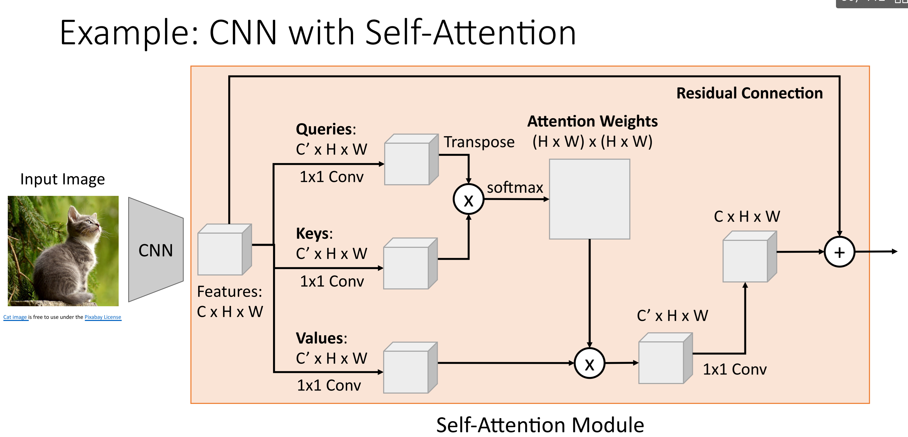
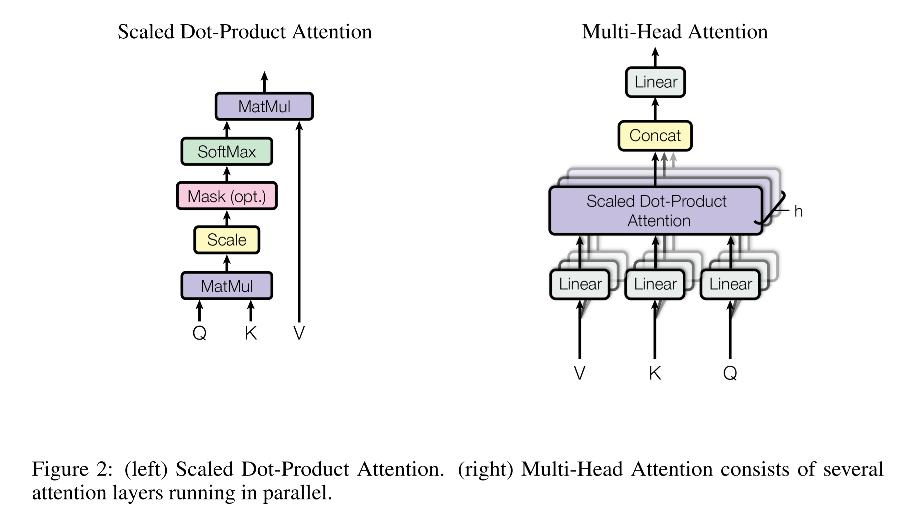
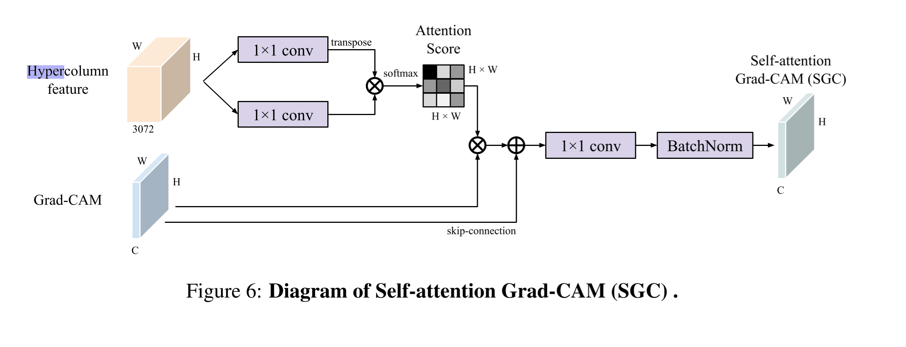
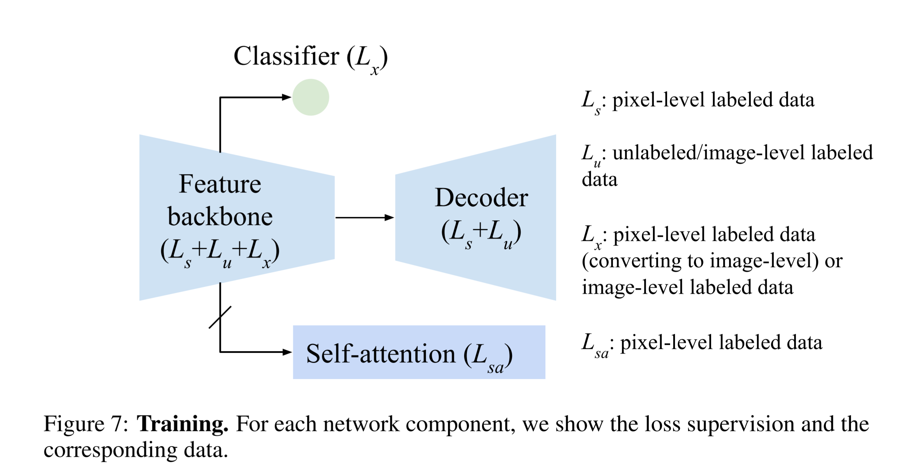
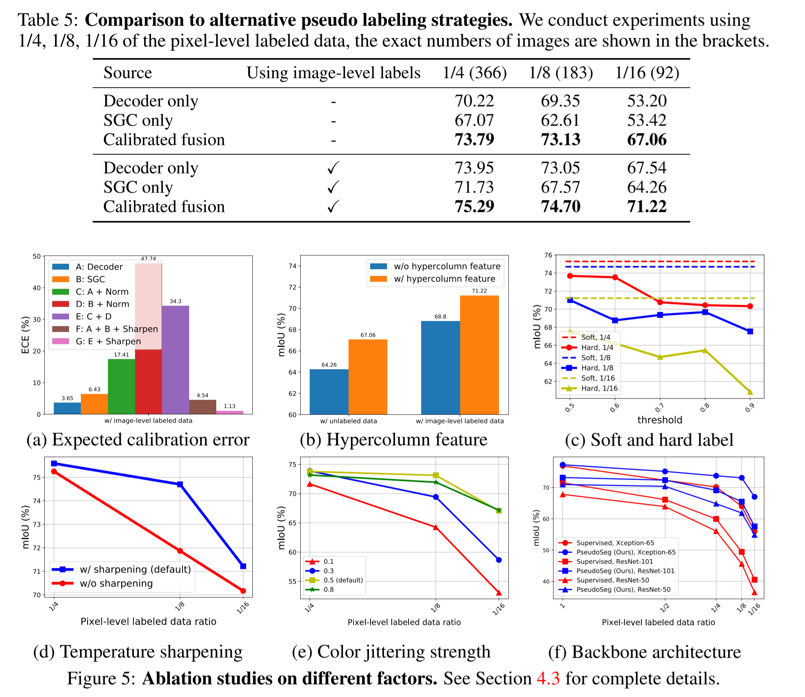

# [main-page](../README.md)

# [PSEUDOSEG: DESIGNING PSEUDO LABELS FOR SEMANTIC SEGMENTATION](../papers/PSEUDOSEG.pdf)

## Related works
* FixMatch
* [Grad-CAM](../papers/Grad-CAM.pdf) | [Code](https://github.com/ramprs/grad-cam/) | [Summary](4.md)
* [hypercolumn](../papers/Hariharan.pdf) | [Summary](../paper-summary/Hariharan-s.md)
* self-attention dot product
  * [598_FA2020_lecture13.pdf](../papers/598_FA2020_lecture13.pdf)
    
      
  * [Attention Is All You Need](../papers/Attention.pdf) | [Summary](Attention-s.md)
    

## Overview

* [x] _follow FixMatch_

   
## Related Work
1. Semi-supervised classification: 
   Consistency regularization and entropy minimization are two common strategies for SSL
   1. The intuition behind consistencybased approaches
     is that, the model output should remain unchanged when the input is perturbed. 
     On the other hand, the entropy minimization strategy argues that the unlabeled data can be used to ensured classes are well-separated, 
     which can be achieved by encouraging the model to output low-entropy predictions. 
     Pseudo-labeling is one of the methods for implicit entropy minimization. 
     Recently, holistic approaches combining both strategies have been proposed and achieved significant improvement. 
     By redesigning the pseudo label, we propose an efficient one-stage semi-supervised learning framework
of semantic segmentation for consistency training
     
2. Semi-supervised semantic segmentation:
    1. GAN-based
    2. learn a discriminator between the prediction and the ground truth mask
    3. Consistency regularization based approaches have also been proposed recently, by enforcing the predictions to be consistent
        1. from augmented input images
        2. perturbed feature embeddings
        3. different networks
        4. dual-branch training network to jointly learn from pixel-accurate and coarse labeled data 
        5. _**iterative self-training approaches:**_ 
            * These methods usually assume the available labeled data is enough to train a good teacher model, which will be used to generate pseudo labels for the student model. However, this condition might not satisfy in the low-data
regime _? whether CL works?_
              
3. Weakly-supervised semantic segmentation:
    1. weaker forms of annotations
        1. bounding boxes
        2. image-level labels (class activation map (CAM)) 
        3. refine CAM:  _?_
            * partial image/feature erasing
            * additional saliency estimation model 
            * pixel similarity to propagate the initial score map  
            * mining and co-segment the same category of objects across images
            * The refined score maps are optimized again using a dense-CRF _?_ model (Kr¨ahenb¨uhl & Koltun, 2011), and then
used as the target to train a separate segmentation network.
              
## Method
1. we seek for a distinct yet efficient decision mechanisms to compensate for the potential errors of decoder outputs. Second, wisely fusing multiple sources of predictions to generate an ensemble and
better-calibrated version of pseudo labels.
   
2. learning localization: [Grad-CAM](../papers/Grad-CAM.pdf)|[Summary](4.md)

3. Calibrated prediction fusion

4. strong data augmentation:
    * SimCLR

## experiment

[Rethinking Pre-training and Self-training](../papers/Rethinking.pdf) | [Summary](../paper-summary/Rethinking-s.md)
* ### ablation

## Questions
1. add Attention directly in decoder module, use co-training from different view?

              

            
    
        

    
   
      

